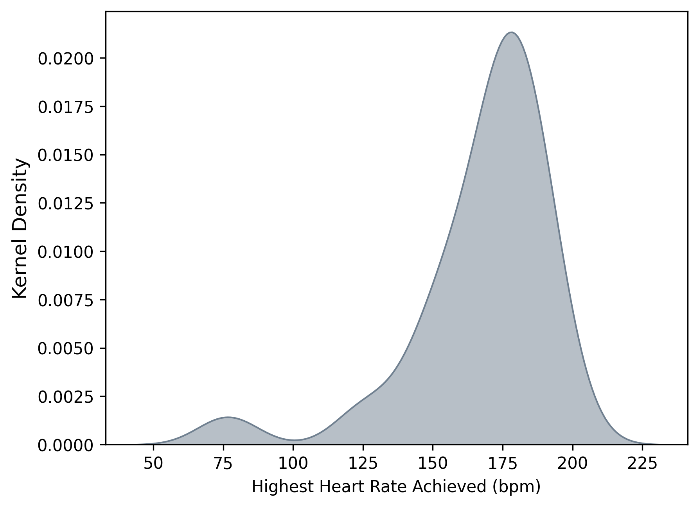
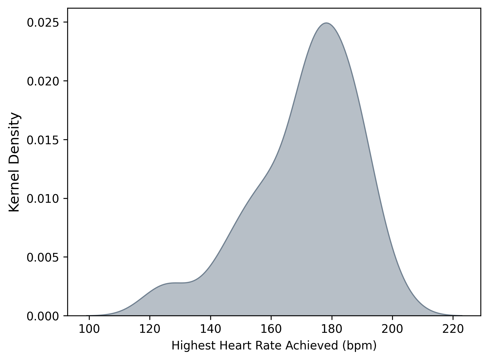
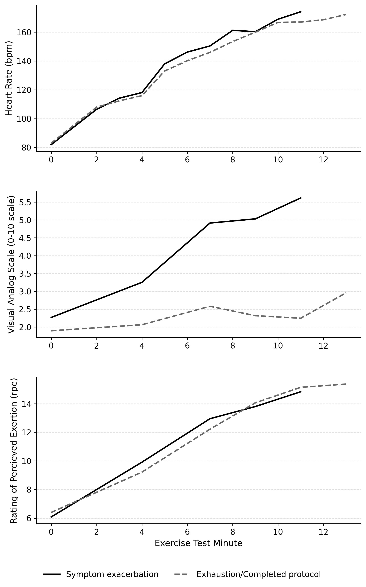

# Predicting exercise test performance in adolescents with concussion
Wingerson, MJ  
mat.wingerson@gmail.com

# Description 
Transparency of source code and results for a manuscript submitted to [journal tbd]. 

[Add citation when accepted]

---

# Overview

## Background:
Engaging in aerobic exercise within days of concussion is the standard of care treatment approach [[ref](https://pubmed.ncbi.nlm.nih.gov/37316185/)]. While the precise dosage of exercise that is optimal for treatment of post-concussion symptoms and other impairments remains a popular research topic, consensus has generally been reached that exercise at an intensity, duration, and frequency that does not exacerbate symptoms is considered safe and beneficial for recovery [[ref](https://pubmed.ncbi.nlm.nih.gov/37316210/), [ref](https://pubmed.ncbi.nlm.nih.gov/30715132/)].  

A common practice for prescribing exercise in clinical settings is through the use of an exercise test [[ref](https://pubmed.ncbi.nlm.nih.gov/40135995/)]. In the controlled clinical setting, a graded exercise test can gradually increase heart rate from resting to moderate/high intensity over the course of 10-15 minutes. Clinicians can monitor patients during the test, looking for one of two stopping criteria: a) an increase in symptoms that is more than mild, b) reaching the point of self-reported exhaustion (typically reported through a percieved exertion scale), or a heart rate that approaches the patients age-predicted maximum heart rate (220bmp - age, HRm), also considered exhaution. Uppon reaching a stopping criteria, clinicians can measure the highest heart rate achieved on the test, refered to as the symptom threshold, or the maximum heart rate the patient is able to tolerate before symptoms increase or exhaustion is reached. The clinician is then able to prescribe 80-90% of this highest heart rate as the heart rate target (HRt), which provides a patient-specific exercise recomendation to perform as part of their recovery. Past work has shown that a HRt of 90% of the highest achieved heart rate during testing for 20-30 minutes, 4-5 days per week is safe and effacous for recovery [[ref](https://pubmed.ncbi.nlm.nih.gov/35489100/) - our work!].  

## Knowledge Gaps:
Though exercise testing for the purposes of deriving patient-specific HRt's is standard clinical practice, no research has systematically described performance during exercise testing with respect to the progression of patient heart rate, rating of percieved exertion, or symptom exacerbation. Demographic, injury, and clinical factors associated with the stopping criteria, or the highest heart rate achieved on the test, have also not been investigated.

Last, though exercise testing is ideal for developing personalized HRt prescriptions for adolescents after concussion, alternative methods exist for deriving heart rate prescriptions in the abscence of exercise tests. One such example is to prescribe 50% of the patients age-predicted maximum heart rate (220bpm - age, HRm). However, this recommendation is an approximation of what it is believed patients will achieve if they had recieved an exercise test, and the actual value ranges from 50-80% of HRm, a wide range that lacks evidential support. 

## Objective:
1. To compare demographics, injury, and clinical characteristics among participants with concussion based on exercise test stop criteria: symptom exacerbation vs exhaustion.

2. To determine if demographics, injury, or clinical characteristics are associated with the maximum achieved heart rate on the exercise test.

3. To evaluate the accuracy of a 50% HRm method for prescirbing a HRt compared to the HRt derived from exercise testing. 

---

# Methods

## Exercise testing:
The graded YMCA protocol is described in our past exercise RCT [[ref](https://pubmed.ncbi.nlm.nih.gov/35489100/) - our work!]. It is similar to the Buffalo Concussion Test described here, but has some important differences that you will see [[ref](https://pubmed.ncbi.nlm.nih.gov/40135995/)]. Big picture summary: The test begins with a baseline measure of resting heart rate, then progresses through stages of exercise on a stationary bike for ~15 minutes. The beginning stages are low rpm (revolutions per minute) and low resistance (Watts). Every 2-3 minutes the rpms and resistance are increased to evoke a heart rate response (increase). The test is over when all stages are completed, or when one of two stop critera are met: 1) symptoms increase more than mildly, or 2) exhaustion is reached. A symptom increase of more than mild is defined as >3.0 points on a 10-point Visual Analog Scale (VAS), where 0.0 represents no symptoms and 10.0 represent the worst symptoms you can have. Exhaustion is defined as >= 17-points on the Borg's Rating of Percieved Exertion (RPE), where 6 represents resting effort and 20 represent the most effort a participant could give (17 generally equated to working "Very Hard"). Exhaustion could also be met if the participant reaches their age-predicted maximum heart rate (220bpm - age). The test can also be stopped if the pariticpant completes all stages, totally approximately 15 minutes of exercise. The highest heart rate achieved during the test is then multiplied by 0.90 (90%) to obtain the heart rate target (HRt). 

For the purposes of analysis, we grouped participants as having symptom exacerbation during the test vs reaching exhaustion/completing the protocol. 

## HRm Method:
Though exercise testing is ideal for developing personalized HRt prescriptions for adolescents after concussion, exercise testing can be burdensome (time, resource, and expertise demands). Therefore, past research has established alternative methods for generating heart rate prescriptions for patients in the abscense of exercise testing [[ref](https://pubmed.ncbi.nlm.nih.gov/32058454/)]. One approach established in previous work is to prescribe a portion of the patients age-predicted maximum heart rate (HRm). It has been suggested that 50% of HRm is recommended for patients as a starting point for exercise, progressing by +5% every day as symptoms allow up to a maximum of 80% HRm. 

**Definitions:**
HRt = Heart rate target, 90% of the highest heart rate achieved on exercise testing.
HRm = Heart rate max, calculated as 220bpm minus the participants age (i.e., 205bpm if age == 15years).

---

# Findings and Figures

## Pre-processing:
**Figure A (not for text):** Kernel density plot showing the distribution of the highest heart rate achieved on the exercise test in our sample. N=105
  
*Interpretation:* A majority of subjects reached a heart rate of between 150bpm and 200bpm during the test. Almost no one went above 200bpm and a smaller portion of the sample was between 100 and 150bpm. 
**Important on this plot is the small 'bump' at ~75bpm. N=4 subjects had a highest achieved heart rate of between 72 and 90bpm. These values are closer to what we would expect for a resting heart rate, not an ending heart rate. These points likely reflect an error in the data. Therefore, they were removed from the analysis.**

**Figure B (not for text):** Kernel density plot showing the distribution of the highest heart rate achieved on the exercise test in our sample. N=101
  
*Interpretation:* This is the same density plot as above, but with the N=4 outlier subjects removed. 

## Exercise test performance:
**Figure 1:** Changes in heart rate, symptoms (visual analog scale), and rating of percieved exertion throughout the exercise test. Mean values at each minute were calculated and ploted for those who stopped due to symptom exacerbation vs those who reached exhaustion or completed the protocol. 
  
*Interpretation:* No significant differences in the heart rate achieved during the test, or in the progression of heart rate throughout the test, between those who stopped due to symptoms and those who reached exhaustion or completed the protocol. 

**Table A (can probably just describe this in the results, don't need to include this table):** Performance on the exercise test. 
|                                  |      | Missing   | Overall        | Range       |
|----------------------------------|------|-----------|----------------|-------------|
| n                                |      |           | 101            |             |
| branch_used, n (%)               | Easy |           | 78 (77.23)     |             |
|                                  |Medium|           | 18 (17.82)     |             |
|                                  | Hard |           | 3 (2.97)       |             |
| Fatigue, n (%)                   |      |           | 11 (10.89)     |             |
| Pain, n (%)                      |      |           | 1 (0.99)       |             |
| Diziness, n (%)                  |      |           | 22 (21.78)     |             |
| Headache, n (%)                  |      |           | 42 (41.58)     |             |
| Nausea, n (%)                    |      |           | 8 (7.92)       |             |
| hr_baseline, mean (SD)           |      | 2         | 82.74 (12.02)  | 59, 111     |
| highest_hr_achieved, mean (SD)   |      | 0         | 171.32 (17.57) | 120, 202    |
| vas_baseline, mean (SD)          |      | 2         | 1.98 (1.65)    | 0.0, 6.4    |
| highest_vas_achieved, mean (SD)  |      | 1         | 3.76 (2.15)    | 0.0, 9.1    |
| highest_rpe_achieved, mean (SD)  |      | 0         | 15.50 (2.32)   | 8, 19       |

*How I would write this up:* Among 101 participants who underwent the exercise test, a majority were routed to the easiest test branch (n=78, 77%), and a smaller proportion completed the medium and hard branches (n=18, 18%; n=3, 3%). The most commonly reported symptoms during the test were headache, endorsed by 42% (n=42) of participants, followed by diziness (n=22, 22%), fatigue (n=11, 11%), and nausea (n=8, 8%). Participant highest achieved heart rate ranged from 120bpm to 202bpm, with a mean+/-standard deviation of 171.3+/-17.6bpm. Baseline VAS ranged from 0.0 to 6.4 (mean+/-sd = 1.98+/-1.7) and the highest VAS reached ranged from 0.0 to 9.1 (3.76+/-2.2). The highest RPE achieved during the test ranged from 8 to 19 on the Borg's RPE scale (15.5+/-2.3). 

## Factors associated with stop criteria:
**Table 1:** Comparison of participant demographics, injury, and clinical characteristics between those who experienced symptom exacerbation during the test and those who reached exhaustion or completed the protocol. 
**Katelyn, you will need to clean these tables up to make publication ready**
|                                  |      | Missing   | Overall        | Symptom exacerbation | Exhaustion/Completed Protocol| P-Value   |
|----------------------------------|------|-----------|----------------|----------------|----------------|-----------|
| n                                |      |           | 101            | 23             | 78             |           |
| Age (years), mean (SD)           |      | 1         | 15.87 (1.48)   | 16.05 (1.51)   | 15.82 (1.47)   | 0.527     |
| sex, n (%)                       | Male |           | 51 (50.50)     | 9 (39.13)      | 42 (53.85)     | 0.369     |
|                                  |Female|           | 49 (48.51)     | 14 (60.87)     | 35 (44.87)     |           |
|                                  |Missing|          | 1 (0.99)       | 0 (0.00)       | 1 (1.28)       |           |
| American Indian or Alaska Native, n (%)||           | 4 (3.96)       | 0 (0.00)       | 4 (5.13)       |           |
| Asian, n (%)                     |      |           | 2 (1.98)       | 0 (0.00)       | 2 (2.56)       |           |
| Black or African-American, n (%) |      |           | 12 (11.88)     | 4 (17.39)      | 8 (10.26)      |           |
| Native Hawaiian or Other Pacific Islander, n (%)||  | 0 (00.00)      | 0 (00.00)      |  (00.00)       |           |
| White, n (%)                     |      |           | 85 (84.16)     | 20 (86.96)     | 65 (83.33)     |           |
| Unknown or not reported, n (%)   |      |           | 5 (4.95)       | 0 (0.00)       | 5 (6.41)       |           |
| Ethnicity, n (%)                 | Hispanic/Latino || 17 (16.83)     | 5 (21.74)      | 12 (15.38)     | 0.563     |
|                                  | Not Hispanic/Latino|| 76 (75.25)  | 15 (65.22)     | 61 (78.21)     |           |
|                                  | Unknown or not reported|| 8 ()    | 3 ()           | 5 ()           |           |
| migraine history, n (%)          | No  |           | 83 (82.18)     | 17 (73.91)     | 66 (84.62)     | 0.357     |
|                                  | Yes  |           | 17 (16.83)     | 6 (26.09)      | 11 (14.10)     |           |
|                                  |Missing|          | 1 (0.99)       | 0 (0.00)       | 1 (1.28)       |           |
| add history, n (%)               | No  |           | 83 (82.18)     | 19 (82.61)     | 64 (82.05)     | 0.860     |
|                                  | Yes  |           | 17 (16.83)     | 4 (17.39)      | 13 (16.67)     |           |
|                                  |Missing|           | 1 (0.99)       | 0 (0.00)       | 1 (1.28)       |           |
| anx history, n (%)               | No  |           | 78 (77.23)     | 19 (82.61)     | 59 (75.64)     | 0.715     |
|                                  | Yes  |           | 22 (21.78)     | 4 (17.39)      | 18 (23.08)     |           |
|                                  |Missing|           | 1 (0.99)       | 0 (0.00)       | 1 (1.28)       |           |
| dep history, n (%)               | No  |           | 84 (83.17)     | 19 (82.61)     | 65 (83.33)     | 0.562     |
|                                  | Yes  |           | 14 (13.86)     | 4 (17.39)      | 10 (12.82)     |           |
|                                  |Missing|           | 3 (2.97)       | 0 (0.00)       | 3 (3.85)       |           |
| msk injury history, n (%)        | No  |           | 30 (29.70)     | 8 (34.78)      | 22 (28.21)     | 0.731     |
|                                  | Yes  |           | 70 (69.31)     | 15 (65.22)     | 55 (70.51)     |           |
|                                  |Missing|          | 1 (0.99)       | 0 (0.00)       | 1 (1.28)       |           |
| loss of conciousness, n (%)      | No  |           | 85 (84.16)     | 20 (86.96)     | 65 (83.33)     | 0.824     |
|                                  | Yes  |           | 15 (14.85)     | 3 (13.04)      | 12 (15.38)     |           |
|                                  |Missing|          | 1 (0.99)       | 0 (0.00)       | 1 (1.28)       |           |
| experienced amnesia, n (%)       | No  |           | 80 (79.21)     | 16 (69.57)     | 64 (82.05)     | 0.362     |
|                                  | Yes  |           | 19 (18.81)     | 6 (26.09)      | 13 (16.67)     |           |
|                                  |Missing|          | 2 (1.98)       | 1 (4.35)       | 1 (1.28)       |           |
| Injured during sports, n (%)     | No  |           | 16 (15.84)     | 5 (21.74)      | 11 (14.10)     | 0.596     |
|                                  | Yes  |           | 84 (83.17)     | 18 (78.26)     | 66 (84.62)     |           |
|                                  |Missing|          | 1 (0.99)       | 0 (0.00)       | 1 (1.28)       |           |
| Engaging in PA currently, n (%)  | No  |           | 50 (49.50)     | 13 (56.52)     | 37 (47.44)     | 0.594     |
|                                  | Yes  |           | 49 (48.51)     | 10 (43.48)     | 39 (50.00)     |           |
|                                  |Missing|          | 2 (1.98)       | 0 (0.00)       | 2 (2.56)       |           |
| concussion history, n (%)        | No  |           | 46 (45.54)     | 11 (47.83)     | 35 (44.87)     | 0.844     |
|                                  | Yes  |           | 54 (53.47)     | 12 (52.17)     | 42 (53.85)     |           |
|                                  |Missing|          | 1 (0.99)       | 0 (0.00)       | 1 (1.28)       |           |
| FiveP score, mean (SD)           |      | 0         | 7.86 (1.74)    | 8.52 (1.50)    | 7.67 (1.77)    | **0.027**     |
| Time to visit 1, mean (SD)       |      | 0         | 13.22 (4.37)   | 11.52 (3.95)   | 13.72 (4.38)   | **0.028**     |
| PCSI pre-injury, mean (SD)       |      | 2         | 10.74 (13.51)  | 11.57 (10.90)  | 10.49 (14.26)  | 0.702     |
| PCSI current, mean (SD)          |      | 1         | 41.01 (23.82)  | 56.26 (23.63)  | 36.45 (22.05)  | **0.001**     |
| hads_anx_subscale, mean (SD)     |      | 1         | 5.61 (3.89)    | 6.74 (4.35)    | 5.27 (3.71)    | 0.153     |
| hads_depress_subscore, mean (SD) |      | 1         | 4.56 (3.23)    | 5.78 (2.88)    | 4.19 (3.26)    | **0.030**     |
| Diziness handicap score, mean (SD)|     | 2         | 23.17 (18.14)  | 36.00 (15.49)  | 19.29 (17.14)  | **<0.001**    |
| Neck disability index, mean (SD) |      | 14        | 11.59 (7.47)   | 16.75 (7.52)   | 10.04 (6.77)   | **0.001**     |

## Factors associated with exercise test highest heart rate:
**Table B (not for text, can describe in results):** Association of participant characteristics with the ending heart rate achieved on the exercise test. 
|                                  | Spearman Rho Correlation       | P-Value       |
|----------------------------------|--------------------------------|---------------|
| Time to Visit 1                  | 0.07                           | 0.46          | 
| Age                              | -0.27                          | **0.008**     | 
| Five P score                     | -0.10                          | 0.34          | 
| PCSI Pre-injury                  | -0.14                          | 0.18          | 
| PCSI Current                     | -0.20                          | **0.04**      | 
| HADS Anxiety score               | -0.09                          | 0.35          | 
| HADS Depression score            | -0.25                          | **0.01**      | 
| Diziness handicap score          | -0.19                          | 0.07          | 
| Neck disability index            | -0.23                          | **0.03**      | 

*Interpretation:* The ending heart rate achieved during exercise testing was significantly associated with age (Rho: -0.27, p=0.008) and PCSI score (Rho: -0.20, p=0.04), such that as age and PCSI score increase, the highest achieved heart rate during exercise testing is expected to decrease. No other participant factors were associated with the ending heart rate achieved during exercise testing, including sex (median diff: 0.5bpm, p=0.47), concussion history (median diff: 1.3bpm, p=0.93), and whether or not the participant had already begun physical activity at the time of testing (median diff: 4.1bpm, p=0.73).

Group: sex
|                     |    | Missing   | Overall             | 0.0                 | 2.0                 | None                | P-Value   |
|---------------------|----|-----------|---------------------|---------------------|---------------------|---------------------|-----------|
| n                   |    |           | 101                 | 51                  | 49                  | 1                   |           |
| HRt, median [Q1,Q3] |    | 0         | 157.5 [143.1,165.6] | 159.3 [148.1,166.9] | 154.8 [142.2,163.8] | 153.9 [153.9,153.9] | 0.473     |

Group: race___0
|                     |    | Missing   | Overall             | 0                   | 1                   | P-Value   |
|---------------------|----|-----------|---------------------|---------------------|---------------------|-----------|
| n                   |    |           | 101                 | 97                  | 4                   |           |
| HRt, median [Q1,Q3] |    | 0         | 157.5 [143.1,165.6] | 157.5 [144.9,165.6] | 149.0 [138.2,158.6] | 0.423     |

Group: race___1
|                     |    | Missing   | Overall             | 0                   | 1                   | P-Value   |
|---------------------|----|-----------|---------------------|---------------------|---------------------|-----------|
| n                   |    |           | 101                 | 99                  | 2                   |           |
| HRt, median [Q1,Q3] |    | 0         | 157.5 [143.1,165.6] | 156.6 [142.7,165.6] | 160.2 [158.8,161.6] | 0.634     |

Group: race___2
|                     |    | Missing   | Overall             | 0                   | 1                   | P-Value   |
|---------------------|----|-----------|---------------------|---------------------|---------------------|-----------|
| n                   |    |           | 101                 | 89                  | 12                  |           |
| HRt, median [Q1,Q3] |    | 0         | 157.5 [143.1,165.6] | 159.3 [150.3,166.5] | 142.2 [132.1,151.7] | 0.001     |
Could not complete for race___3: Need at least two groups in stats.kruskal()

Group: race___4
|                     |    | Missing   | Overall             | 0                   | 1                   | P-Value   |
|---------------------|----|-----------|---------------------|---------------------|---------------------|-----------|
| n                   |    |           | 101                 | 16                  | 85                  |           |
| HRt, median [Q1,Q3] |    | 0         | 157.5 [143.1,165.6] | 149.4 [141.5,155.5] | 159.3 [149.4,166.5] | 0.016     |

Group: race___6
|                     |    | Missing   | Overall             | 0                   | 1                   | P-Value   |
|---------------------|----|-----------|---------------------|---------------------|---------------------|-----------|
| n                   |    |           | 101                 | 96                  | 5                   |           |
| HRt, median [Q1,Q3] |    | 0         | 157.5 [143.1,165.6] | 157.5 [144.4,165.6] | 154.8 [139.5,161.1] | 0.511     |

Group: ethnicity
|                     |    | Missing   | Overall             | 0.0                 | 1.0                 | 2.0                 | None                | P-Value   |
|---------------------|----|-----------|---------------------|---------------------|---------------------|---------------------|---------------------|-----------|
| n                   |    |           | 101                 | 17                  | 76                  | 6                   | 2                   |           |
| HRt, median [Q1,Q3] |    | 0         | 157.5 [143.1,165.6] | 144.9 [135.9,155.7] | 158.9 [149.2,166.5] | 161.1 [155.7,169.2] | 158.4 [156.2,160.7] | 0.081     |

Group: loc
|                     |    | Missing   | Overall             | 0.0                 | 1.0                 | None                | P-Value   |
|---------------------|----|-----------|---------------------|---------------------|---------------------|---------------------|-----------|
| n                   |    |           | 101                 | 85                  | 15                  | 1                   |           |
| HRt, median [Q1,Q3] |    | 0         | 157.5 [143.1,165.6] | 157.5 [142.2,165.6] | 157.5 [153.4,162.4] | 153.9 [153.9,153.9] | 0.919     |

Group: amnesia_yn
|                     |    | Missing   | Overall             | 0.0                 | 1.0                 | None                | P-Value   |
|---------------------|----|-----------|---------------------|---------------------|---------------------|---------------------|-----------|
| n                   |    |           | 101                 | 80                  | 19                  | 2                   |           |
| HRt, median [Q1,Q3] |    | 0         | 157.5 [143.1,165.6] | 157.1 [142.2,164.9] | 157.5 [153.4,167.4] | 155.7 [154.8,156.6] | 0.562     |

Group: meds_yn
|                     |    | Missing   | Overall             | 0.0                 | 1.0                 | None                | P-Value   |
|---------------------|----|-----------|---------------------|---------------------|---------------------|---------------------|-----------|
| n                   |    |           | 101                 | 48                  | 50                  | 3                   |           |
| HRt, median [Q1,Q3] |    | 0         | 157.5 [143.1,165.6] | 155.2 [142.2,166.5] | 159.3 [151.4,164.7] | 153.9 [148.5,161.1] | 0.802     |

Group: sports_yn
|                     |    | Missing   | Overall             | 0.0                 | 1.0                 | None                | P-Value   |
|---------------------|----|-----------|---------------------|---------------------|---------------------|---------------------|-----------|
| n                   |    |           | 101                 | 16                  | 84                  | 1                   |           |
| HRt, median [Q1,Q3] |    | 0         | 157.5 [143.1,165.6] | 160.2 [151.7,167.6] | 156.6 [142.9,164.7] | 153.9 [153.9,153.9] | 0.687     |

Group: physactivity_yn
|                     |    | Missing   | Overall             | 0.0                 | 1.0                 | None                | P-Value   |
|---------------------|----|-----------|---------------------|---------------------|---------------------|---------------------|-----------|
| n                   |    |           | 101                 | 50                  | 49                  | 2                   |           |
| HRt, median [Q1,Q3] |    | 0         | 157.5 [143.1,165.6] | 159.8 [142.2,166.5] | 155.7 [148.5,163.8] | 157.1 [155.5,158.6] | 0.725     |

Group: conc_hx_yn
|                     |    | Missing   | Overall             | 0.0                 | 1.0                 | None                | P-Value   |
|---------------------|----|-----------|---------------------|---------------------|---------------------|---------------------|-----------|
| n                   |    |           | 101                 | 46                  | 54                  | 1                   |           |
| HRt, median [Q1,Q3] |    | 0         | 157.5 [143.1,165.6] | 157.1 [142.2,165.6] | 158.4 [148.7,164.5] | 153.9 [153.9,153.9] | 0.928     |

Group: migraine_hx
|                     |    | Missing   | Overall             | 0.0                 | 1.0                 | None                | P-Value   |
|---------------------|----|-----------|---------------------|---------------------|---------------------|---------------------|-----------|
| n                   |    |           | 101                 | 83                  | 17                  | 1                   |           |
| HRt, median [Q1,Q3] |    | 0         | 157.5 [143.1,165.6] | 157.5 [142.7,165.6] | 158.4 [144.9,164.7] | 153.9 [153.9,153.9] | 0.920     |

Group: add_hx
|                     |    | Missing   | Overall             | 0.0                 | 1.0                 | None                | P-Value   |
|---------------------|----|-----------|---------------------|---------------------|---------------------|---------------------|-----------|
| n                   |    |           | 101                 | 83                  | 17                  | 1                   |           |
| HRt, median [Q1,Q3] |    | 0         | 157.5 [143.1,165.6] | 156.6 [142.7,165.2] | 161.1 [150.3,166.5] | 153.9 [153.9,153.9] | 0.788     |

Group: anx_hx
|                     |    | Missing   | Overall             | 0.0                 | 1.0                 | None                | P-Value   |
|---------------------|----|-----------|---------------------|---------------------|---------------------|---------------------|-----------|
| n                   |    |           | 101                 | 78                  | 22                  | 1                   |           |
| HRt, median [Q1,Q3] |    | 0         | 157.5 [143.1,165.6] | 157.5 [142.4,164.5] | 157.5 [148.9,167.4] | 153.9 [153.9,153.9] | 0.735     |

Group: dep_hx
|                     |    | Missing   | Overall             | 0.0                 | 1.0                 | None                | P-Value   |
|---------------------|----|-----------|---------------------|---------------------|---------------------|---------------------|-----------|
| n                   |    |           | 101                 | 84                  | 14                  | 3                   |           |
| HRt, median [Q1,Q3] |    | 0         | 157.5 [143.1,165.6] | 158.9 [148.9,165.6] | 149.4 [141.5,159.5] | 153.9 [132.3,163.8] | 0.304     |

Group: mskinjury_hx_yn
|                     |    | Missing   | Overall             | 0.0                 | 1.0                 | None                | P-Value   |
|---------------------|----|-----------|---------------------|---------------------|---------------------|---------------------|-----------|
| n                   |    |           | 101                 | 30                  | 70                  | 1                   |           |
| HRt, median [Q1,Q3] |    | 0         | 157.5 [143.1,165.6] | 156.6 [142.2,164.5] | 157.5 [148.7,165.6] | 153.9 [153.9,153.9] | 0.897     |

Group: branch_used
|                     |    | Missing   | Overall             | 0.0                 | 1.0                 | 2.0                 | None                | P-Value   |
|---------------------|----|-----------|---------------------|---------------------|---------------------|---------------------|---------------------|-----------|
| n                   |    |           | 101                 | 78                  | 18                  | 3                   | 2                   |           |
| HRt, median [Q1,Q3] |    | 0         | 157.5 [143.1,165.6] | 156.2 [142.2,167.4] | 159.3 [151.2,162.0] | 157.5 [157.1,159.8] | 120.2 [114.1,126.2] | 0.182     |

Group: bike_sympt___1
|                     |    | Missing   | Overall             | 0                   | 1                   | P-Value   |
|---------------------|----|-----------|---------------------|---------------------|---------------------|-----------|
| n                   |    |           | 101                 | 90                  | 11                  |           |
| HRt, median [Q1,Q3] |    | 0         | 157.5 [143.1,165.6] | 158.9 [147.8,166.5] | 153.9 [141.3,156.6] | 0.072     |

Group: bike_sympt___2
|                     |    | Missing   | Overall             | 0                   | 1                   | P-Value   |
|---------------------|----|-----------|---------------------|---------------------|---------------------|-----------|
| n                   |    |           | 101                 | 100                 | 1                   |           |
| HRt, median [Q1,Q3] |    | 0         | 157.5 [143.1,165.6] | 157.1 [142.9,165.6] | 163.8 [163.8,163.8] | 0.482     |

Group: bike_sympt___3
|                     |    | Missing   | Overall             | 0                   | 1                   | P-Value   |
|---------------------|----|-----------|---------------------|---------------------|---------------------|-----------|
| n                   |    |           | 101                 | 79                  | 22                  |           |
| HRt, median [Q1,Q3] |    | 0         | 157.5 [143.1,165.6] | 159.3 [148.9,167.4] | 152.6 [142.2,158.2] | 0.021     |

Group: bike_sympt___4
|                     |    | Missing   | Overall             | 0                   | 1                   | P-Value   |
|---------------------|----|-----------|---------------------|---------------------|---------------------|-----------|
| n                   |    |           | 101                 | 59                  | 42                  |           |
| HRt, median [Q1,Q3] |    | 0         | 157.5 [143.1,165.6] | 159.3 [149.4,166.9] | 153.9 [142.2,164.5] | 0.240     |

Group: bike_sympt___5
|                     |    | Missing   | Overall             | 0                   | 1                   | P-Value   |
|---------------------|----|-----------|---------------------|---------------------|---------------------|-----------|
| n                   |    |           | 101                 | 93                  | 8                   |           |
| HRt, median [Q1,Q3] |    | 0         | 157.5 [143.1,165.6] | 157.5 [144.9,165.6] | 154.4 [142.9,158.2] | 0.493     |

## HRm performance metrics:

## Optimal HRm methods:

## Personalized prescription in the absence of exercise testing:

--- 

# Key take-aways

---

# Statistical Methods Write-up

---
