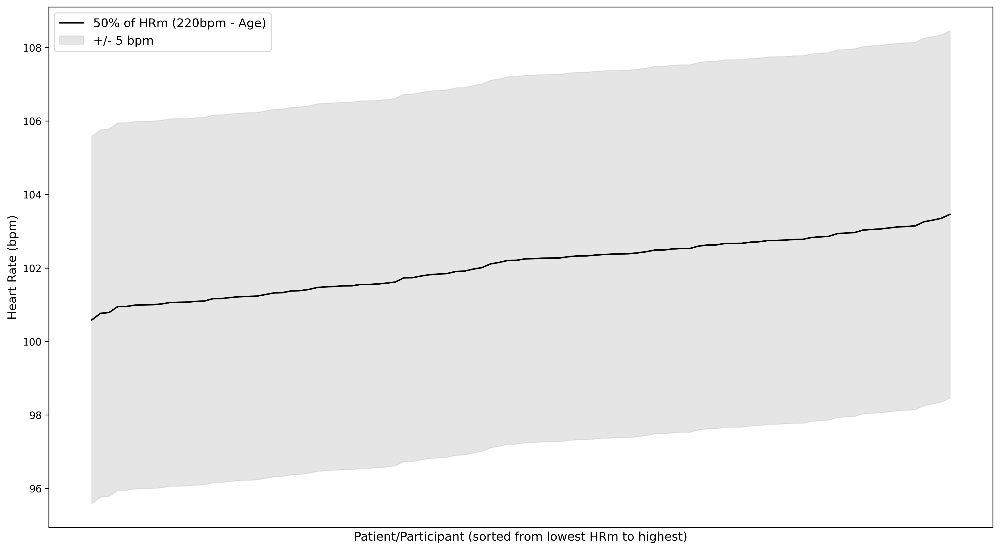
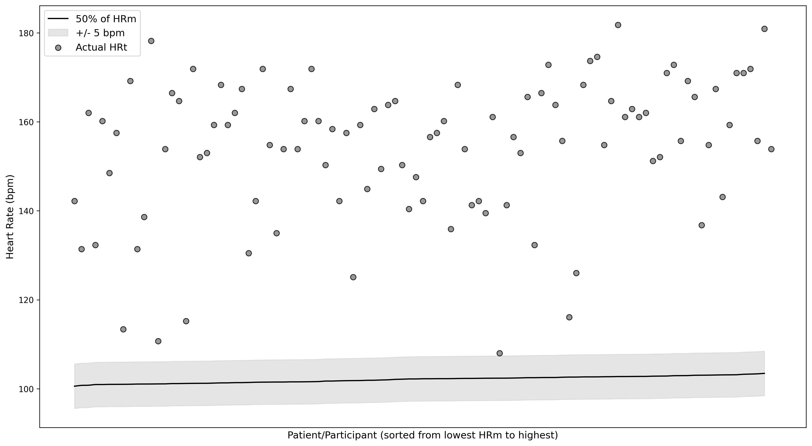
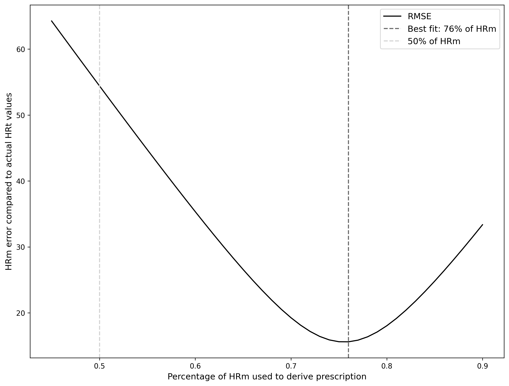
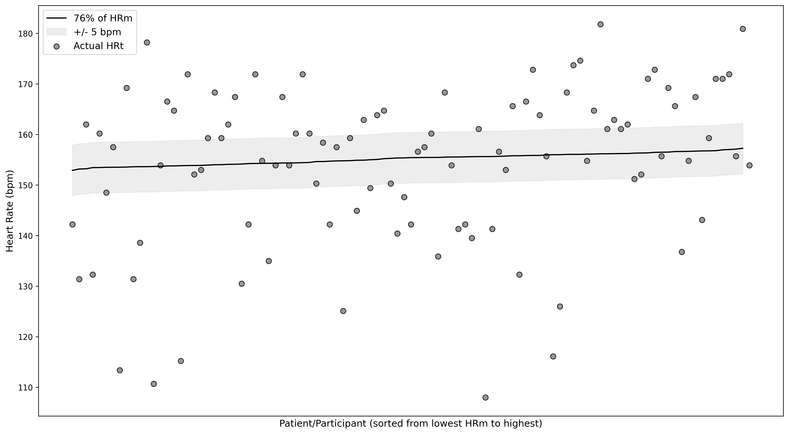
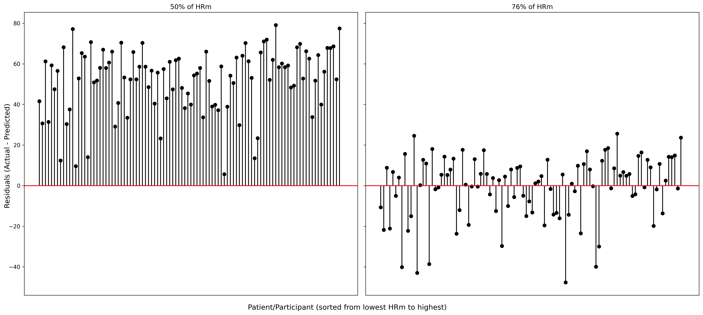
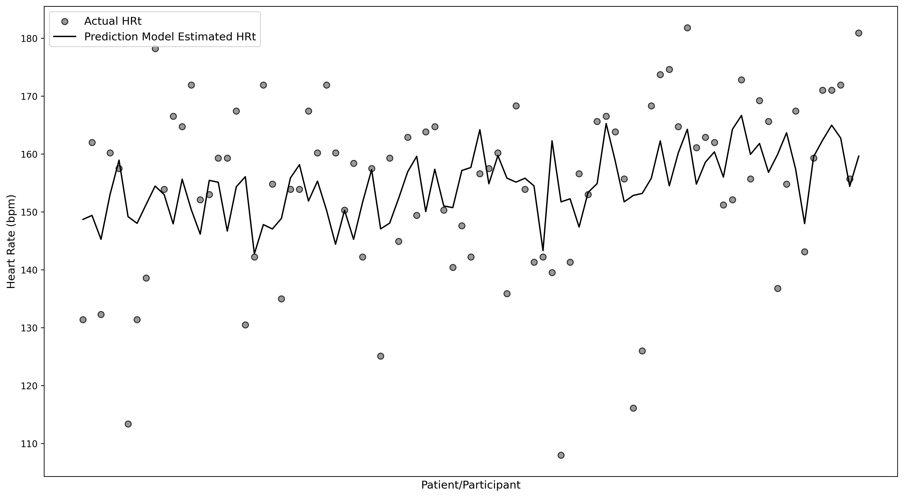
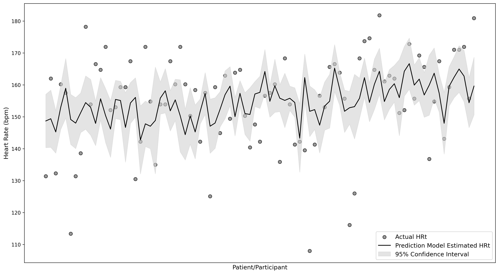
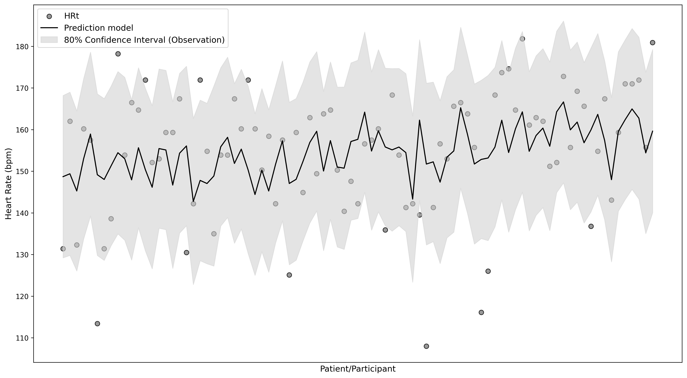

# Predicting exercise test performance in adolescents with concussion
Wingerson, MJ  
mat.wingerson@gmail.com

# Description 
Transparency of source code and results for a manuscript submitted to [journal tbd]. 

[Add citation when accepted]

---

# Overview

## Background:
Engaging in aerobic exercise within days of concussion is the standard of care treatment approach [[ref](https://pubmed.ncbi.nlm.nih.gov/37316185/)]. While the precise dosage of exercise optimal for treatment of post-concussion symptoms and other impairments remains a popular research topic, consensus has generally been reached that exercise at an intensity, duration, and frequency that does not exacerbate symptoms is considered safe and likely beneficial for recovery [[ref](https://pubmed.ncbi.nlm.nih.gov/37316210/), [ref](https://pubmed.ncbi.nlm.nih.gov/30715132/)].  

A common practice for prescribing exercise in clinical settings is through exercise testing [[ref](https://pubmed.ncbi.nlm.nih.gov/40135995/)]. In controlled clinical settings, a graded exercise test can gradually increase heart rate from resting to moderate/high intensity for 10-15 minutes. Clinicians can monitor patients during the test, looking for one of two stopping criteria: a) an increase in symptoms that is more than mild, b) reaching the point of self-reported exhaustion (typically reported through a percieved exertion scale), or a heart rate that approaches the patients age-predicted maximum heart rate (220bmp - age, HRm), also considered exhaution. Upon reaching a stopping criteria, clinicians can measure the highest heart rate achieved on the test, called the symptom threshold, defined as the maximum heart rate the patient can tolerate before symptoms increase or exhaustion is reached. The clinician can then prescribe 80-90% of this highest heart rate as the heart rate target (HRt), which provides a patient-specific exercise recommendation. Past work has shown that  an HRt that is 90% of the highest achieved heart rate during testing can be safely performed for 20-30 minutes, 4-5 days per week, after concussion [[ref](https://pubmed.ncbi.nlm.nih.gov/35489100/) - our work!].  

## Knowledge Gaps:
Though exercise testing to derive patient-specific HRt's is standard clinical practice, no research has systematically described performance during exercise testing with respect to the progression of patient heart rate, rating of perceived exertion, or symptom exacerbation. Demographic, injury, and clinical factors associated with the stopping criteria or the highest heart rate achieved on the test have also not been investigated.

Last, while exercise testing is the gold standard for developing personalized HRt prescriptions for adolescents following concussion, alternative methods are available when such testing is not feasible. A common approach is to prescribe 50% of the patient's age-predicted maximum heart rate (HRm), calculated as 220 beats per minute minus the patient's age. However, this method is a rough estimate of the HRt a patient might reach during an exercise test. In practice, actual HRt values can vary widely, and the accuracy of a 50%HRm method compared to an exercise test-derived HRt has not been established. 

## Objective:
1. To compare demographics, injury, and clinical characteristics among participants with concussion based on exercise test stop criteria: symptom exacerbation vs exhaustion.

2. To determine if demographics, injury, or clinical characteristics are associated with the HRt derived from an exercise test.

3. To evaluate the accuracy of a 50%HRm method for prescribing exercise compared to the HRt derived from an exercise test. 

---

# Methods

## Exercise testing:
The graded YMCA protocol is described in our past RCT [[ref](https://pubmed.ncbi.nlm.nih.gov/35489100/) - our work!]. It is similar to the Buffalo Concussion Test described here but has some important differences that you will see [[ref](https://pubmed.ncbi.nlm.nih.gov/40135995/)]. Big picture summary: The test begins with a baseline measure of resting heart rate, then progresses through stages of exercise on a stationary bike for ~15 minutes. The beginning stages are low rpm (revolutions per minute) and low resistance (Watts). Every 2-3 minutes, the rpm and resistance are increased to evoke a heart rate response (increase). The test is over when all stages are completed or when one of two stop criteria are met: 1) symptoms increase more than mildly, or 2) exhaustion is reached. A symptom increase of more than mild is defined as >3.0 points on a 10-point Visual Analog Scale (VAS), where 0.0 represents no symptoms and 10.0 represents the worst symptoms you can have. Exhaustion is defined as >= 17 points on the Borg's Rating of Percieved Exertion (RPE), where 6 represents resting effort and 20 represents the most effort a participant could give (17 generally equates to working "Very Hard"). Exhaustion could also be met if the participant reaches their age-predicted maximum heart rate (220bpm - age). The test can also be stopped if the participant completes all stages. The highest heart rate achieved during the test is multiplied by 0.90 (90%) to obtain the heart rate target (HRt). 

For objective #1, we grouped participants as experiencing symptom exacerbation during the test vs reaching exhaustion/completing the protocol.  

## HRm Method:
Past research has established alternative methods for generating heart rate prescriptions in the absence of exercise testing [[ref](https://pubmed.ncbi.nlm.nih.gov/32058454/)]. One approach established in previous work is to prescribe a portion of the patient's age-predicted maximum heart rate (HRm). Specifically, patients might begin exercising at 50% of their HRm, with daily increases of 5% as tolerated, up to a maximum of 80%HRm.

**Definitions**  
HRt = Heart rate target, 90% of the highest heart rate achieved on exercise testing.  
HRm = Heart rate max, calculated as 220bpm minus the participant's age (i.e., 205bpm if age == 15years).  

---

# Findings and Figures

## Pre-processing:
**Figure A (not for text):** Kernel density plot showing the distribution of the highest heart rate achieved on the exercise test in our sample. N=105
  
*Interpretation:* A majority of subjects reached a heart rate of between 150bpm and 200bpm during the test. Almost no one went above 200bpm, and a smaller portion of the sample was between 100 and 150bpm. 
**Important on this plot is the small 'bump' at ~75bpm. N=4 subjects had a highest achieved heart rate of between 72 and 90bpm. These values are closer to what we would expect for a resting heart rate, not an ending heart rate. These points likely reflect an error in the data. Therefore, they were removed from the analysis.**

**Figure B (not for text):** Kernel density plot showing the distribution of the highest heart rate achieved on the exercise test in our sample. N=101
  
*Interpretation:* This is the same density plot as above, but with the N=4 outlier subjects removed. 

## Exercise test performance:
**Figure 1:** Changes in heart rate, symptoms (visual analog scale), and rating of perceived exertion throughout the exercise test. Mean values at each minute were calculated and plotted for those who stopped due to symptom exacerbation vs those who reached exhaustion or completed the protocol. 
  
*Interpretation:* No significant differences in the heart rate achieved during the test, or in the progression of heart rate throughout the test, between those who stopped due to symptoms and those who reached exhaustion or completed the protocol. 

**Table A (can probably just describe this in the results, don't need to include this table):** Performance on the exercise test. 
|                                  |      | Missing   | Overall        | Range       |
|----------------------------------|------|-----------|----------------|-------------|
| n                                |      |           | 101            |             |
| branch_used, n (%)               | Easy |           | 78 (77.23)     |             |
|                                  |Medium|           | 18 (17.82)     |             |
|                                  | Hard |           | 3 (2.97)       |             |
| Fatigue, n (%)                   |      |           | 11 (10.89)     |             |
| Pain, n (%)                      |      |           | 1 (0.99)       |             |
| Diziness, n (%)                  |      |           | 22 (21.78)     |             |
| Headache, n (%)                  |      |           | 42 (41.58)     |             |
| Nausea, n (%)                    |      |           | 8 (7.92)       |             |
| hr_baseline, mean (SD)           |      | 2         | 82.74 (12.02)  | 59, 111     |
| highest_hr_achieved, mean (SD)   |      | 0         | 171.32 (17.57) | 120, 202    |
| HRt (90% of highest hr), mean (SD)|     | 0         | 154.19 (15.82) | 108, 181.8  |
| vas_baseline, mean (SD)          |      | 2         | 1.98 (1.65)    | 0.0, 6.4    |
| highest_vas_achieved, mean (SD)  |      | 1         | 3.76 (2.15)    | 0.0, 9.1    |
| highest_rpe_achieved, mean (SD)  |      | 0         | 15.50 (2.32)   | 8, 19       |

*How I would write this up:* Among 101 participants who underwent the exercise test, a majority were routed to the easiest test branch (n=78, 77%), and a smaller proportion completed the medium and hard branches (n=18, 18%; n=3, 3%). The most commonly reported symptoms during the test were headache, endorsed by 42% (n=42) of participants, followed by dizziness (n=22, 22%), fatigue (n=11, 11%), and nausea (n=8, 8%). The participant's highest achieved heart rate ranged from 120bpm to 202bpm, with a mean+/-standard deviation of 171.3+/-17.6bpm. Baseline VAS ranged from 0.0 to 6.4 (mean+/-sd = 1.98+/-1.7), and the highest VAS reached ranged from 0.0 to 9.1 (3.76+/-2.2). The highest RPE achieved during the test ranged from 8 to 19 on the Borg's RPE scale (15.5+/-2.3). 

---

## Factors associated with stop criteria:
**Table 1:** Comparison of participant demographics, injury, and clinical characteristics between those who experienced symptom exacerbation during the test and those who reached exhaustion or completed the protocol. 
**Katelyn, you will need to clean these tables up to make publication ready**
|                                  |      | Missing   | Overall        | Symptom exacerbation | Exhaustion/Completed Protocol| P-Value   |
|----------------------------------|------|-----------|----------------|----------------|----------------|-----------|
| n                                |      |           | 101            | 23             | 78             |           |
| Age (years), mean (SD)           |      | 1         | 15.87 (1.48)   | 16.05 (1.51)   | 15.82 (1.47)   | 0.527     |
| sex, n (%)                       | Male |           | 51 (50.50)     | 9 (39.13)      | 42 (53.85)     | 0.369     |
|                                  |Female|           | 49 (48.51)     | 14 (60.87)     | 35 (44.87)     |           |
| American Indian or Alaska Native, n (%)||           | 4 (3.96)       | 0 (0.00)       | 4 (5.13)       |           |
| Asian, n (%)                     |      |           | 2 (1.98)       | 0 (0.00)       | 2 (2.56)       |           |
| Black or African-American, n (%) |      |           | 12 (11.88)     | 4 (17.39)      | 8 (10.26)      |           |
| Native Hawaiian or Other Pacific Islander, n (%)||  | 0 (00.00)      | 0 (00.00)      |  (00.00)       |           |
| White, n (%)                     |      |           | 85 (84.16)     | 20 (86.96)     | 65 (83.33)     |           |
| Unknown or not reported, n (%)   |      |           | 5 (4.95)       | 0 (0.00)       | 5 (6.41)       |           |
| Ethnicity, n (%)                 | Hispanic/Latino || 17 (16.83)     | 5 (21.74)      | 12 (15.38)     | 0.563     |
|                                  | Not Hispanic/Latino|| 76 (75.25)  | 15 (65.22)     | 61 (78.21)     |           |
|                                  | Unknown or not reported|| 8 ()    | 3 ()           | 5 ()           |           |
| anx history, n (%)               | No  |            | 78 (77.23)     | 19 (82.61)     | 59 (75.64)     | 0.715     |
|                                  | Yes  |           | 22 (21.78)     | 4 (17.39)      | 18 (23.08)     |           |
| dep history, n (%)               | No  |            | 84 (83.17)     | 19 (82.61)     | 65 (83.33)     | 0.562     |
|                                  | Yes  |           | 14 (13.86)     | 4 (17.39)      | 10 (12.82)     |           |
| msk injury history, n (%)        | No  |            | 30 (29.70)     | 8 (34.78)      | 22 (28.21)     | 0.731     |
|                                  | Yes  |           | 70 (69.31)     | 15 (65.22)     | 55 (70.51)     |           |
| loss of conciousness, n (%)      | No  |            | 85 (84.16)     | 20 (86.96)     | 65 (83.33)     | 0.824     |
|                                  | Yes  |           | 15 (14.85)     | 3 (13.04)      | 12 (15.38)     |           |
| experienced amnesia, n (%)       | No  |            | 80 (79.21)     | 16 (69.57)     | 64 (82.05)     | 0.362     |
|                                  | Yes  |           | 19 (18.81)     | 6 (26.09)      | 13 (16.67)     |           |
| Injured during sports, n (%)     | No  |            | 16 (15.84)     | 5 (21.74)      | 11 (14.10)     | 0.596     |
|                                  | Yes  |           | 84 (83.17)     | 18 (78.26)     | 66 (84.62)     |           |
| Engaging in PA currently, n (%)  | No  |            | 50 (49.50)     | 13 (56.52)     | 37 (47.44)     | 0.594     |
|                                  | Yes  |           | 49 (48.51)     | 10 (43.48)     | 39 (50.00)     |           |
| concussion history, n (%)        | No  |            | 46 (45.54)     | 11 (47.83)     | 35 (44.87)     | 0.844     |
|                                  | Yes  |           | 54 (53.47)     | 12 (52.17)     | 42 (53.85)     |           |
| FiveP score, mean (SD)           |      | 0         | 7.86 (1.74)    | 8.52 (1.50)    | 7.67 (1.77)    | **0.027** |
| Time to visit 1, mean (SD)       |      | 0         | 13.22 (4.37)   | 11.52 (3.95)   | 13.72 (4.38)   | **0.028** |
| PCSI pre-injury, mean (SD)       |      | 2         | 10.74 (13.51)  | 11.57 (10.90)  | 10.49 (14.26)  | 0.702     |
| PCSI current, mean (SD)          |      | 1         | 41.01 (23.82)  | 56.26 (23.63)  | 36.45 (22.05)  | **0.001** |
| hads_anx_subscale, mean (SD)     |      | 1         | 5.61 (3.89)    | 6.74 (4.35)    | 5.27 (3.71)    | 0.153     |
| hads_depress_subscore, mean (SD) |      | 1         | 4.56 (3.23)    | 5.78 (2.88)    | 4.19 (3.26)    | **0.030** |
| Diziness handicap score, mean (SD)|     | 2         | 23.17 (18.14)  | 36.00 (15.49)  | 19.29 (17.14)  | **<0.001**|
| Neck disability index, mean (SD) |      | 14        | 11.59 (7.47)   | 16.75 (7.52)   | 10.04 (6.77)   | **0.001** |

**One subject did not complete the intake form, so some of the categorical variables will be 1 short of N=101.*

---

## Factors associated with exercise test HRt:
**Table B (not for text, can describe in results):** Association of participant characteristics with the exercise test HRt (90% of highest achieved HR). 
|                                  | Spearman Rho Correlation       | P-Value       |
|----------------------------------|--------------------------------|---------------|
| Time to Visit 1                  | 0.07                           | 0.46          | 
| Age                              | -0.27                          | **0.008**     | 
| Five P score                     | -0.10                          | 0.34          | 
| PCSI Pre-injury                  | -0.14                          | 0.18          | 
| PCSI Current                     | -0.20                          | **0.04**      | 
| HADS Anxiety score               | -0.09                          | 0.35          | 
| HADS Depression score            | -0.25                          | **0.01**      | 
| Diziness handicap score          | -0.19                          | 0.07          | 
| Neck disability index            | -0.23                          | **0.03**      | 

*Interpretation:* HRt after exercise testing was significantly associated with age (Rho: -0.27, p=0.008), PCSI score (Rho: -0.20, p=0.04), HADS depression score (Rho: -0.25, p=0.01), and Neck Disability Index score (Rho: -0.23, p=0.03). As these factors increase, HRt is expected to decrease. No other participant factors were associated with HRt, including sex (median diff: 0.5bpm, p=0.47), concussion history (median diff: 1.3bpm, p=0.93), and whether or not the participant had already begun physical activity at the time of testing (median diff: 4.1bpm, p=0.73). <--- If you have other categorical variables that might be interesting to describe alongside these, let me know so I can give you the median difference and p-values. 

---

## HRm accuracy metrics:
The objective of the HRm-based method is to approximate the target heart rate (HRt) a patient would have reached during an exercise test, particularly for those unable to complete such testing. To evaluate the accuracy of this approach, we can compare the HRm-based prescriptions to the actual HRt values observed in participants who completed the bike test. The standard HRm recommendation is to begin at-home exercise at 50% of HRm, increasing by 5% each day that exercise is tolerated, up to a maximum of 80%HRm. At each level, it is common practice to create a target heart rate range by adding +/-5 beats per minute (bpm) to the prescribed value. This is shown in the figure below.

**Figure B (not for text, just for fun):** 50% of HRm plotted for every subject in our dataset. HRm is defined as 220bpm minus the participant's age. The x-axis represents every subject in the dataset, sorted from lowest to highest HRm. The oldest and youngest participants in the dataset have been labeled. 
  
**Make note of the y-axis here. All the HRm recommendations at 50%HRm are between 101 and 104 bpm.**

However, when we plot this same 50%HRm approach alongside the actual HRt values obtained from the exercise test, we see that the 50%HRm approach is incredibly conservative in its estimations. This is shown in the figure below.

**Figure C (not for text):** 50%HRm for each subject plotted against the HRt achieved by participants after undergoing exercise testing. The x-axis represents every subject in the dataset, sorted from lowest to highest HRm. The oldest and youngest participants in the dataset have been labeled, and their actual HRt values have been circled in red. 
  

Here is the actual figure to put in the manuscript: 

**Figure 2:** 50% of HRm for each subject plotted against the HRt achieved by participants after undergoing exercise testing. 
  

*Interpretation:* The 50%HRm approach substantially underestimates the actual heart rate that participants can tolerate after a concussion. To evaluate its accuracy, we defined a capture rate as the percentage of observed HRt values that fall within ±5 bpm of the predicted value - represented by the shaded region in the figure. The capture rate using the 50%HRm method was 0.000% (lol). The Root Mean Square Error (RMSE) was 54.4 bpm, and the Mean Absolute Error (MAE) was 52.1 bpm. MAE is the average difference between the predicted value (50%HRm) and the actual observed value (HRt). An MAE of 52.1 bpm means that, on average, the prediction was off by 52 bpm - pretty gnarly. RMSE is similar to MAE but penalizes larger errors more heavily. In both RMSE and MAE, lower values indicate better accuracy. So, the high MAE and RMSE values here tell us that the 50%HRm method performs poorly. You can see this in the figure; the predicted values never align with actual HRt values.

The 50%HRm method also comes with a progression component. Patients are to begin exercise at 50%HRm and increase by 5% of HRm each day that exercise is tolerated, up to a maximum of 80% HRm. Another way to think about error is to ask: if I gave a participant a 50%HRm prescription and told them to increase daily by 5% as symptoms allow, how many days would it take for a participant to reach their actual HRt if they followed this progression exactly? In other words, starting at 50% HRm and increasing by 5% each day, how long until their prescribed heart rate finally overlaps with the true HRt determined by an exercise test (i.e., when the shaded prediction range in the figure finally captures their actual value)? The answer to this question is a value I am calling "Days needed to capture". **On average, when starting at 50%HRm, it would take participants 6.08 days of incrementally increasing exercise before they reach the heart rate that we could have identified for them immediately with an exercise test (i.e., their HRt).**

Capture rate: 0%  
RMSE: 54.4  
AME: 52.1  
Days needed to capture: 6.08 days  

---

## Optimal HRm methods:
With this established, the natural next question is, what percent of HRm would be better aligned with the HRt obtained from exercise testing? 

We can test that! Starting at 40%HRm, we calculate RMSE (same as above, tells us how far off that estimate is from the actual HRt). Then we can do the same thing for 41% of HRm... and continue on with 1% changes up to 90%HRm. Eventually, we will get to a percentage of HRm that better predicts the HRt. And if we go too high on our percentage of HRm, our RMSE values will start to go up again. That is shown in the figure below. 

**Figure 3:** Root Mean Square Error (RMSE) representing the difference between heart rates derived from varying percentages of HRm and the actual HRt values. The y-axis shows RMSE prediction error. The x-axis represents different percentages of HRm, ranging from 40% to 90%, used to estimate HRt. A light grey vertical line marks 50% HRm, the currently recommended clinical starting point. A dark grey vertical line highlights the optimal %HRm, which produced the lowest RMSE, indicating the most accurate prediction of HRt.
  
*Interpretation:* A prescription of 50%HRm generates predictions with substantial error compared to actual HRt values. Prescribing a higher percent of HRm decreases error, but only up to about 75% of HRm. Above that, we start to over-predict heart rate, and our error starts to increase again.  

Therefore, 76%HRm is a better predictor of HRt than 50%HRm. We can visualize this as well: 

**Figure 4:** 76% of HRm for each subject plotted against the HRt achieved by participants after undergoing exercise testing. 
  
*Interpretation:* Though over-predicting heart rate for some subjects, using 76%HRm is a better predictor of HRt than 50%HRm. The capture rate for 76%HRm is 27.0%, improved from 0% when using 50%HRm. The RMSE and MAE are 15.6 bpm and 12.1 bpm, respectively, improved from the 50%HRm method, which had an RMSE of 54.4 bpm and an MAE of 52.1 bpm. 

Days to capture can also be estimated for 76%HRm. Assuming a patient adjusts their exercise intensity by +/-5% of HRm each day based on symptom tolerance - just as they would in the 50%HRm method - the average time to reach their actual HRt is 2.13 days. In other words, even if we slightly over- or under-estimate their HRt using the 76% HRm starting point, the patient would enter their correct heart rate zone by the second day of at-home exercise. This is a substantial improvement compared to the 50%HRm method, which wouldn’t guide participants into the correct zone until approximately day 6, almost a full week after their initial clinic visit.

capture rate: 27.0%  
RMSE: 15.6  
AME: 12.1  
Days to capture: 2.13  

**Figure D (include in text if you want, but not necessary):** Residuals comparing the actual HRt and the predicted heart rate derived from 50%HRm and 75%HRm methods.
  

--- 

**To me, the information above is plenty for a manuscript.**  

**However, you know I can't resist a prediction model...**

---
## Personalized prescription in the absence of exercise testing:
76%HRm as a prescription has less error, a better capture rate, and fewer days to capture compared to a 50%HRm recommendation. However, undergoing exercise testing and obtaining an actual HRt is still a 'gold standard' approach. Why? Because the exercise test is specific to each individual. Above, we identified a number of measured characteristics that affect the HRt, such as initial symptom severity, age, etc. There may also be unmeasured factors (confounders) that we don't know about, didn't measure, etc., that could also affect a person's HRt. So, actually getting them on the exercise bike and deriving an HRt is the best approach. Even when using the 76%HRm method, the predicted heart rate only differs between subjects by about 2 bpm. This means everyone is essentially getting the same recommendation. This is not personalized medicine at all... 

Sooooooo, the question is: Can we take this existing HRm method and account for some other important participant characteristics? 

We identified earlier that HRt is univariably associated with only a few factors: PCSI score, age, Neck Disability Index score, and HADS depression score. If we wanted to add one more factor to the model, we could add time since injury, even though it was not significant. Adding time since injury essentially controls for the amount of 'recovery' that could've happened before the participant arrives in our lab for exercise testing. 

**Results of personalized predictive model (N=83 due to missing data in predictors):**

**Table E (not for text):** I was concerned about multicolinearity when including PCSI, time to visit, NDI and HADS depression subscores all in the same model. Oftentimes, these factors move together. However, VIF was low for all variables, so it must not be an issue. No need to include this information in the manuscript; I'm just showing David that I checked for VIF. :)
| Feature  | Variance of Inflation Factor (VIF) |
| -------- | ---------------------------------- |
| PCSI Score | 1.92 |
| Age | 1.06 | 
| Time to visit 1 | 1.04 |
| NDI score | 1.56 | 
| HADS depres | 1.55 | 

After developing the prediction model, we get an equation that shows how each factor affects the target heart rate. We can also evaluate performance metrics in the same way as above. RMSE and MAE are 13.9 bpm and 10.9 bpm, respectively. Adjusted R2 is a measure of how well our model captures the variations in HRt. Typically, something above 0.20 (or 20%) is a good value. Our adjusted R2 is 0.09, which means this prediction model is only explaining 9% of the variance in HRt. Not great, but this only means that there are lots of other factors that we have not measured that affect HRt, so more research to be done! 

RMSE: 13.98  
AME: 10.9  
Adj R2: 0.09  

**Model Equation:**  
HRt = (185.838 * const) + (-0.063 * pcsi_total_current) + (-1.879 * age_visit) + (0.473 * doi_to_v1) + (-0.209 * ndi_score) + (-0.646 * hads_depress_subscore)

**Model Equation Simplified:**  

HRt =
- 186bpm as a starting place
  - subtract 0.06 x PCSI score... so kids who are more symptomatic will have a lower predicted HRt
  - subtract 1.9 x age... so older kids will have a lower predicted HRt
  - add 0.5 x days since injury... so those further out from injury will have a higher HRt
  - subtract 0.2 x Neck Disability Index score... so those with neck issues will have a lower HRt
  - subtract 0.6 x HADS depression score... so those with more depression symptoms will have a lower HRt

## Model summary:
No need to include in text. Just showing here. **Intercept must be significant for us to get any sort of valid predictions.**
| Variable | Coef's are above in model equation | P-value |
| -------- | ---------------------------------- | ------- | 
| Intercept | | <0.001 | 
| PCSI | | 0.50 | 
| Age | | 0.097 | 
| Time to visit | | 0.182 | 
| NDI score | | 0.427 | 
| HADS depression score | | 0.271 | 

## Visualize! 
**Figure E:** Prediction model plotted alongside the actual bike test HRt values. 
  
*Interpretation:* The prediction model is "bouncing around", which may seem less than ideal. But this is very good because it shows that the model is capturing meaningful individual differences based on factors like age, symptoms, and other clinical variables. Rather than assigning the same heart rate prescription to everyone, the model produces a wide range of HRt predictions, from around 165 bpm down to 140 bpm. AKA personalized medicine! 

--- 

## Confidence Intervals:
There are two approaches we can use to calculate confidence intervals (CI). We can base the CI on inference about the population mean, or we can base it on the observed error in individual predictions. These sound similar, but here’s the difference:

**CIs based on model coefficients**  
How to calculate:
- Variance of residuals = SUM(y_true - y_pred)^2 / (n - number of predictors) ---> this gives us a measure of uncertainty in the predictions
- Variance for each coefficient = variance of residuals × covariance of predictors ---> this reflects how much uncertainty in the outcome is due to predictor spread or multicollinearity
- Take the square root of each coefficient's variance to get the standard error (SE)
- The SE is then multiplied by a t-critical value to calculate a 95% CI

Given this person’s values for age, symptoms, etc., what is the mean and CI we would expect for HRt?  
This approach reflects a population-level inference: among people with similar characteristics, this is the range of expected HRt values.

**Figure F:** Prediction model plotted alongside HRt values, with 95% Confidence Interval included.  
  
*Interpretation:* The capture rate for the 95% CI range is 50.6%. The average width of the confidence interval is 14.6 bpm, with a range of 7.5 bpm to 33.4 bpm. Our capture rate of 50.6% is better than the 76%HRm method capture rate of 27% and does so by only increasing the prediction interval from 10 bpm to an average of 14.6 bpm.  

Capture rate: 50.6%  
CI width: 14.6 bpm, range = 7.5, 33.4  

**CIs based on prediction intervals:**  
Given this subject’s values, what is the range of values within which we expect their HRt to fall, accounting for individual variability?
- In other words, when estimating the population mean (as above), we can use a narrow confidence interval because we assume the sample is a good reflection of the population.
  - But when estimating an individual’s true value, there is more uncertainty because individuals can vary a lot, even among those with similar characteristics.
- So, we include an additional error term, which increases the width of the confidence interval to account for this variability.

The calculation is nearly the same as for the population-based CI, except:
- A +1 is added in the formula for the variance of the prediction
- Why? This extra term accounts for randomness at the individual level that can't be explained by the model
- I'm using an 80% CI here instead of a 95% CI because a higher level of confidence would give us such a wide interval that it becomes not clinically useful.
  - And I think we can use the term prediction interval (PI) instead to describe this. 

**Figure G:** Prediction model plotted alongside HRt values, with 80% Prediction Interval included.  
  
*Interpretation:* The capture rate for an 80% PI (i.e., not population mean, so it will be wider despite being less confident) is 82.8%. The average width of the confidence interval is 38.7 bpm, with a range of 37.7 to 43.2 bpm. So our capture rate is higher than above, but the interval range is substantially larger.   

Capture rate: 82.8%  
PI width: 38.7 bpm, range = 37.7, 43.2  

---

# Summary of predictions

1. 50%HRm is too low
2. 76%HRm is better but fails to account for individual factors that affect HRt and instead returns the same recommendation for everyone
3. A prediction model that uses age, PCSI score, time since injury, Neck Disability score, and HADS depression score can predict HRt with better accuracy.
   a. When using a 95% CI, we get a slightly larger interval of possible HRt values. But still a reasonably sized interval with good accuracy.
   b. When using an 80% PI (prediction interval that accounts for individual variability), we get a much larger interval size. So large, in fact, that it becomes clinically meaningless.

--- 

# Statistical Methods Write-up

To complete when we have agreed on an approach...

---

# Prediction Calculator 
**Not medical advice** Please do not sue me... I am judgment-proof anyway. ;)  

https://wingersonmj.github.io/Exercise_test_HRm/

--- 
