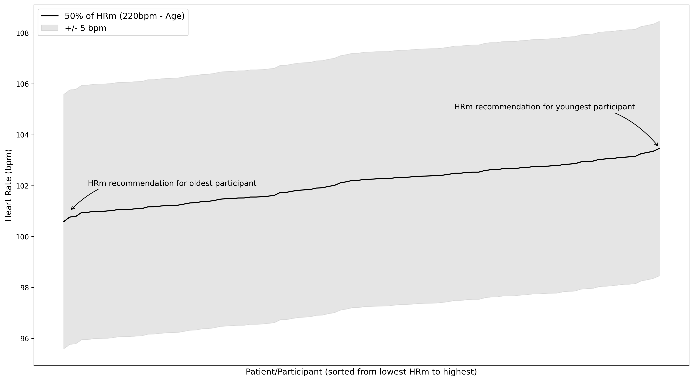
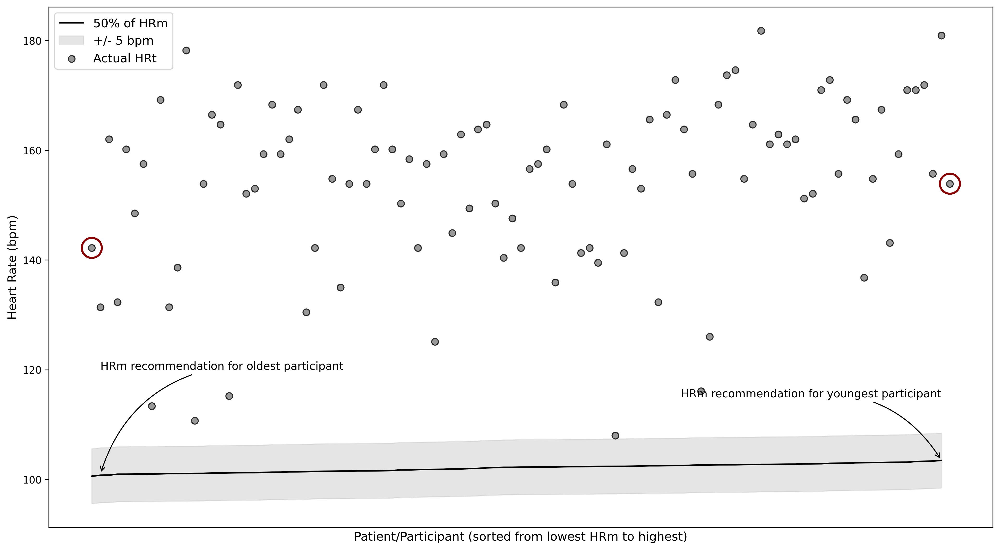

# Predicting exercise test performance in adolescents with concussion
Wingerson, MJ  
mat.wingerson@gmail.com

# Description 
Transparency of source code and results for a manuscript submitted to [journal tbd]. 

[Add citation when accepted]

---

# Overview

## Background:
Engaging in aerobic exercise within days of concussion is the standard of care treatment approach [[ref](https://pubmed.ncbi.nlm.nih.gov/37316185/)]. While the precise dosage of exercise that is optimal for treatment of post-concussion symptoms and other impairments remains a popular research topic, consensus has generally been reached that exercise at an intensity, duration, and frequency that does not exacerbate symptoms is considered safe and beneficial for recovery [[ref](https://pubmed.ncbi.nlm.nih.gov/37316210/), [ref](https://pubmed.ncbi.nlm.nih.gov/30715132/)].  

A common practice for prescribing exercise in clinical settings is through the use of an exercise test [[ref](https://pubmed.ncbi.nlm.nih.gov/40135995/)]. In the controlled clinical setting, a graded exercise test can gradually increase heart rate from resting to moderate/high intensity over the course of 10-15 minutes. Clinicians can monitor patients during the test, looking for one of two stopping criteria: a) an increase in symptoms that is more than mild, b) reaching the point of self-reported exhaustion (typically reported through a percieved exertion scale), or a heart rate that approaches the patients age-predicted maximum heart rate (220bmp - age, HRm), also considered exhaution. Uppon reaching a stopping criteria, clinicians can measure the highest heart rate achieved on the test, refered to as the symptom threshold, or the maximum heart rate the patient is able to tolerate before symptoms increase or exhaustion is reached. The clinician is then able to prescribe 80-90% of this highest heart rate as the heart rate target (HRt), which provides a patient-specific exercise recomendation to perform as part of their recovery. Past work has shown that a HRt of 90% of the highest achieved heart rate during testing for 20-30 minutes, 4-5 days per week is safe and effacous for recovery [[ref](https://pubmed.ncbi.nlm.nih.gov/35489100/) - our work!].  

## Knowledge Gaps:
Though exercise testing for the purposes of deriving patient-specific HRt's is standard clinical practice, no research has systematically described performance during exercise testing with respect to the progression of patient heart rate, rating of percieved exertion, or symptom exacerbation. Demographic, injury, and clinical factors associated with the stopping criteria, or the highest heart rate achieved on the test, have also not been investigated.

Last, though exercise testing is ideal for developing personalized HRt prescriptions for adolescents after concussion, alternative methods exist for deriving heart rate prescriptions in the abscence of exercise tests. One such example is to prescribe 50% of the patients age-predicted maximum heart rate (220bpm - age, HRm). However, this recommendation is an approximation of what it is believed patients will achieve if they had recieved an exercise test, and the actual value ranges from 50-80% of HRm, a wide range that lacks evidential support. 

## Objective:
1. To compare demographics, injury, and clinical characteristics among participants with concussion based on exercise test stop criteria: symptom exacerbation vs exhaustion.

2. To determine if demographics, injury, or clinical characteristics are associated with the maximum achieved heart rate on the exercise test.

3. To evaluate the accuracy of a 50% HRm method for prescirbing a HRt compared to the HRt derived from exercise testing. 

---

# Methods

## Exercise testing:
The graded YMCA protocol is described in our past exercise RCT [[ref](https://pubmed.ncbi.nlm.nih.gov/35489100/) - our work!]. It is similar to the Buffalo Concussion Test described here, but has some important differences that you will see [[ref](https://pubmed.ncbi.nlm.nih.gov/40135995/)]. Big picture summary: The test begins with a baseline measure of resting heart rate, then progresses through stages of exercise on a stationary bike for ~15 minutes. The beginning stages are low rpm (revolutions per minute) and low resistance (Watts). Every 2-3 minutes the rpms and resistance are increased to evoke a heart rate response (increase). The test is over when all stages are completed, or when one of two stop critera are met: 1) symptoms increase more than mildly, or 2) exhaustion is reached. A symptom increase of more than mild is defined as >3.0 points on a 10-point Visual Analog Scale (VAS), where 0.0 represents no symptoms and 10.0 represent the worst symptoms you can have. Exhaustion is defined as >= 17-points on the Borg's Rating of Percieved Exertion (RPE), where 6 represents resting effort and 20 represent the most effort a participant could give (17 generally equated to working "Very Hard"). Exhaustion could also be met if the participant reaches their age-predicted maximum heart rate (220bpm - age). The test can also be stopped if the pariticpant completes all stages, totally approximately 15 minutes of exercise. The highest heart rate achieved during the test is then multiplied by 0.90 (90%) to obtain the heart rate target (HRt). 

For the purposes of analysis, we grouped participants as having symptom exacerbation during the test vs reaching exhaustion/completing the protocol. 

## HRm Method:
Though exercise testing is ideal for developing personalized HRt prescriptions for adolescents after concussion, exercise testing can be burdensome (time, resource, and expertise demands). Therefore, past research has established alternative methods for generating heart rate prescriptions for patients in the abscense of exercise testing [[ref](https://pubmed.ncbi.nlm.nih.gov/32058454/)]. One approach established in previous work is to prescribe a portion of the patients age-predicted maximum heart rate (HRm). It has been suggested that 50% of HRm is recommended for patients as a starting point for exercise, progressing by +5% every day as symptoms allow up to a maximum of 80% HRm. 

**Definitions:**
HRt = Heart rate target, 90% of the highest heart rate achieved on exercise testing.
HRm = Heart rate max, calculated as 220bpm minus the participants age (i.e., 205bpm if age == 15years).

---

# Findings and Figures

## Pre-processing:
**Figure A (not for text):** Kernel density plot showing the distribution of the highest heart rate achieved on the exercise test in our sample. N=105
  
*Interpretation:* A majority of subjects reached a heart rate of between 150bpm and 200bpm during the test. Almost no one went above 200bpm and a smaller portion of the sample was between 100 and 150bpm. 
**Important on this plot is the small 'bump' at ~75bpm. N=4 subjects had a highest achieved heart rate of between 72 and 90bpm. These values are closer to what we would expect for a resting heart rate, not an ending heart rate. These points likely reflect an error in the data. Therefore, they were removed from the analysis.**

**Figure B (not for text):** Kernel density plot showing the distribution of the highest heart rate achieved on the exercise test in our sample. N=101
  
*Interpretation:* This is the same density plot as above, but with the N=4 outlier subjects removed. 

## Exercise test performance:
**Figure 1:** Changes in heart rate, symptoms (visual analog scale), and rating of percieved exertion throughout the exercise test. Mean values at each minute were calculated and ploted for those who stopped due to symptom exacerbation vs those who reached exhaustion or completed the protocol. 
  
*Interpretation:* No significant differences in the heart rate achieved during the test, or in the progression of heart rate throughout the test, between those who stopped due to symptoms and those who reached exhaustion or completed the protocol. 

**Table A (can probably just describe this in the results, don't need to include this table):** Performance on the exercise test. 
|                                  |      | Missing   | Overall        | Range       |
|----------------------------------|------|-----------|----------------|-------------|
| n                                |      |           | 101            |             |
| branch_used, n (%)               | Easy |           | 78 (77.23)     |             |
|                                  |Medium|           | 18 (17.82)     |             |
|                                  | Hard |           | 3 (2.97)       |             |
| Fatigue, n (%)                   |      |           | 11 (10.89)     |             |
| Pain, n (%)                      |      |           | 1 (0.99)       |             |
| Diziness, n (%)                  |      |           | 22 (21.78)     |             |
| Headache, n (%)                  |      |           | 42 (41.58)     |             |
| Nausea, n (%)                    |      |           | 8 (7.92)       |             |
| hr_baseline, mean (SD)           |      | 2         | 82.74 (12.02)  | 59, 111     |
| highest_hr_achieved, mean (SD)   |      | 0         | 171.32 (17.57) | 120, 202    |
| HRt (90% of highest hr), mean (SD)|     | 0         | 154.19 (15.82) | 108, 181.8  |
| vas_baseline, mean (SD)          |      | 2         | 1.98 (1.65)    | 0.0, 6.4    |
| highest_vas_achieved, mean (SD)  |      | 1         | 3.76 (2.15)    | 0.0, 9.1    |
| highest_rpe_achieved, mean (SD)  |      | 0         | 15.50 (2.32)   | 8, 19       |

*How I would write this up:* Among 101 participants who underwent the exercise test, a majority were routed to the easiest test branch (n=78, 77%), and a smaller proportion completed the medium and hard branches (n=18, 18%; n=3, 3%). The most commonly reported symptoms during the test were headache, endorsed by 42% (n=42) of participants, followed by diziness (n=22, 22%), fatigue (n=11, 11%), and nausea (n=8, 8%). Participant highest achieved heart rate ranged from 120bpm to 202bpm, with a mean+/-standard deviation of 171.3+/-17.6bpm. Baseline VAS ranged from 0.0 to 6.4 (mean+/-sd = 1.98+/-1.7) and the highest VAS reached ranged from 0.0 to 9.1 (3.76+/-2.2). The highest RPE achieved during the test ranged from 8 to 19 on the Borg's RPE scale (15.5+/-2.3). 

---

## Factors associated with stop criteria:
**Table 1:** Comparison of participant demographics, injury, and clinical characteristics between those who experienced symptom exacerbation during the test and those who reached exhaustion or completed the protocol. 
**Katelyn, you will need to clean these tables up to make publication ready**
|                                  |      | Missing   | Overall        | Symptom exacerbation | Exhaustion/Completed Protocol| P-Value   |
|----------------------------------|------|-----------|----------------|----------------|----------------|-----------|
| n                                |      |           | 101            | 23             | 78             |           |
| Age (years), mean (SD)           |      | 1         | 15.87 (1.48)   | 16.05 (1.51)   | 15.82 (1.47)   | 0.527     |
| sex, n (%)                       | Male |           | 51 (50.50)     | 9 (39.13)      | 42 (53.85)     | 0.369     |
|                                  |Female|           | 49 (48.51)     | 14 (60.87)     | 35 (44.87)     |           |
|                                  |Missing|          | 1 (0.99)       | 0 (0.00)       | 1 (1.28)       |           |
| American Indian or Alaska Native, n (%)||           | 4 (3.96)       | 0 (0.00)       | 4 (5.13)       |           |
| Asian, n (%)                     |      |           | 2 (1.98)       | 0 (0.00)       | 2 (2.56)       |           |
| Black or African-American, n (%) |      |           | 12 (11.88)     | 4 (17.39)      | 8 (10.26)      |           |
| Native Hawaiian or Other Pacific Islander, n (%)||  | 0 (00.00)      | 0 (00.00)      |  (00.00)       |           |
| White, n (%)                     |      |           | 85 (84.16)     | 20 (86.96)     | 65 (83.33)     |           |
| Unknown or not reported, n (%)   |      |           | 5 (4.95)       | 0 (0.00)       | 5 (6.41)       |           |
| Ethnicity, n (%)                 | Hispanic/Latino || 17 (16.83)     | 5 (21.74)      | 12 (15.38)     | 0.563     |
|                                  | Not Hispanic/Latino|| 76 (75.25)  | 15 (65.22)     | 61 (78.21)     |           |
|                                  | Unknown or not reported|| 8 ()    | 3 ()           | 5 ()           |           |
| anx history, n (%)               | No  |            | 78 (77.23)     | 19 (82.61)     | 59 (75.64)     | 0.715     |
|                                  | Yes  |           | 22 (21.78)     | 4 (17.39)      | 18 (23.08)     |           |
|                                  |Missing|          | 1 (0.99)       | 0 (0.00)       | 1 (1.28)       |           |
| dep history, n (%)               | No  |            | 84 (83.17)     | 19 (82.61)     | 65 (83.33)     | 0.562     |
|                                  | Yes  |           | 14 (13.86)     | 4 (17.39)      | 10 (12.82)     |           |
|                                  |Missing|          | 3 (2.97)       | 0 (0.00)       | 3 (3.85)       |           |
| msk injury history, n (%)        | No  |            | 30 (29.70)     | 8 (34.78)      | 22 (28.21)     | 0.731     |
|                                  | Yes  |           | 70 (69.31)     | 15 (65.22)     | 55 (70.51)     |           |
|                                  |Missing|          | 1 (0.99)       | 0 (0.00)       | 1 (1.28)       |           |
| loss of conciousness, n (%)      | No  |            | 85 (84.16)     | 20 (86.96)     | 65 (83.33)     | 0.824     |
|                                  | Yes  |           | 15 (14.85)     | 3 (13.04)      | 12 (15.38)     |           |
|                                  |Missing|          | 1 (0.99)       | 0 (0.00)       | 1 (1.28)       |           |
| experienced amnesia, n (%)       | No  |            | 80 (79.21)     | 16 (69.57)     | 64 (82.05)     | 0.362     |
|                                  | Yes  |           | 19 (18.81)     | 6 (26.09)      | 13 (16.67)     |           |
|                                  |Missing|          | 2 (1.98)       | 1 (4.35)       | 1 (1.28)       |           |
| Injured during sports, n (%)     | No  |            | 16 (15.84)     | 5 (21.74)      | 11 (14.10)     | 0.596     |
|                                  | Yes  |           | 84 (83.17)     | 18 (78.26)     | 66 (84.62)     |           |
|                                  |Missing|          | 1 (0.99)       | 0 (0.00)       | 1 (1.28)       |           |
| Engaging in PA currently, n (%)  | No  |            | 50 (49.50)     | 13 (56.52)     | 37 (47.44)     | 0.594     |
|                                  | Yes  |           | 49 (48.51)     | 10 (43.48)     | 39 (50.00)     |           |
|                                  |Missing|          | 2 (1.98)       | 0 (0.00)       | 2 (2.56)       |           |
| concussion history, n (%)        | No  |            | 46 (45.54)     | 11 (47.83)     | 35 (44.87)     | 0.844     |
|                                  | Yes  |           | 54 (53.47)     | 12 (52.17)     | 42 (53.85)     |           |
|                                  |Missing|          | 1 (0.99)       | 0 (0.00)       | 1 (1.28)       |           |
| FiveP score, mean (SD)           |      | 0         | 7.86 (1.74)    | 8.52 (1.50)    | 7.67 (1.77)    | **0.027** |
| Time to visit 1, mean (SD)       |      | 0         | 13.22 (4.37)   | 11.52 (3.95)   | 13.72 (4.38)   | **0.028** |
| PCSI pre-injury, mean (SD)       |      | 2         | 10.74 (13.51)  | 11.57 (10.90)  | 10.49 (14.26)  | 0.702     |
| PCSI current, mean (SD)          |      | 1         | 41.01 (23.82)  | 56.26 (23.63)  | 36.45 (22.05)  | **0.001** |
| hads_anx_subscale, mean (SD)     |      | 1         | 5.61 (3.89)    | 6.74 (4.35)    | 5.27 (3.71)    | 0.153     |
| hads_depress_subscore, mean (SD) |      | 1         | 4.56 (3.23)    | 5.78 (2.88)    | 4.19 (3.26)    | **0.030** |
| Diziness handicap score, mean (SD)|     | 2         | 23.17 (18.14)  | 36.00 (15.49)  | 19.29 (17.14)  | **<0.001**|
| Neck disability index, mean (SD) |      | 14        | 11.59 (7.47)   | 16.75 (7.52)   | 10.04 (6.77)   | **0.001** |

---

## Factors associated with exercise test HRt:
**Table B (not for text, can describe in results):** Association of participant characteristics with the exercise test HRt (90% of highest achieved HR). 
|                                  | Spearman Rho Correlation       | P-Value       |
|----------------------------------|--------------------------------|---------------|
| Time to Visit 1                  | 0.07                           | 0.46          | 
| Age                              | -0.27                          | **0.008**     | 
| Five P score                     | -0.10                          | 0.34          | 
| PCSI Pre-injury                  | -0.14                          | 0.18          | 
| PCSI Current                     | -0.20                          | **0.04**      | 
| HADS Anxiety score               | -0.09                          | 0.35          | 
| HADS Depression score            | -0.25                          | **0.01**      | 
| Diziness handicap score          | -0.19                          | 0.07          | 
| Neck disability index            | -0.23                          | **0.03**      | 

*Interpretation:* HRt after exercise testing was significantly associated with age (Rho: -0.27, p=0.008) and PCSI score (Rho: -0.20, p=0.04), such that as age and PCSI score increase, HRt is expected to decrease. No other participant factors were associated with HRt, including sex (median diff: 0.5bpm, p=0.47), concussion history (median diff: 1.3bpm, p=0.93), and whether or not the participant had already begun physical activity at the time of testing (median diff: 4.1bpm, p=0.73).

---

## HRm accuracy metrics:
The objective of the HRm method is to approximate the HRt that would have been achieved on the exercise test for those patients where exercise testing is no available. We can evalute the accuracy of existing HRm methods among participants who did complete the bike test in order to see if the HRm that would have been prescribe acurately represents the actual HRt for that participant. The established HRm recomendation is to have participants begin at-home exercise at 50% of HRm, and to increase by 5% of HRm each day that exercise is tollerated, up to a maximum of 80% HRm. At each level, it is common practice to add 5bpm to each side to create a target range. This is shown the figure below.

**Figure B (not for text, just for fun):** 50% of HRm plotted for every subject in our dataset. HRm is defined as 220bpm minus the participants age. The x-axis represents every subject in the dataset, sorted from lowest to highest HRm. The oldest and youngest participants in the dataset have been labeled. 
  
**Make note of the y-axis here. All the HRm recomendations at 50% of HRm are between 101 and 104bpm.**

However, when we plot this same 50% HRm approach alongside the actual HRt that participants obtained from the exercise test, what we see is that the 50% HRm approach is incredibly conservative in its estimations. HRm is defined as 220bpm minus the participants age. The x-axis represents every subject in the dataset, sorted from lowest to highest HRm. Shown in the figure below. 

**Figure C (not for text):** 50% of HRm for each subject plotted against the HRt achieved by participants after undergoing exercise testing. The x-axis represents every subject in the dataset, sorted from lowest to highest HRm. The oldest and youngest participants in the dataset have been labeled, and their actual HRt values have been circled in red. 
  

And here is the actual figure to put in the manuscript: 

**Figure 2:** 50% of HRm for each subject plotted against the HRt achieved by participants after undergoing exercise testing. 
  
*Interpretation:* The 50% HRm approach substantially under-predicts the actual heart rate that can be tollerated by participants after concussion. Capture rate is defined as the percentage of HRt values that fall within the range of +/-5bpm of the predicted value (i.e., the shaded region in the figure). The **capture rate** achieved by the 50% HRm method, when including a +/- 5bpm interval, was 0.00% (lol). The **Root Mean Square Error** was 54.4bpm and the **Absolute Mean Error** was 52.1bpm. What are RMSE and AME? AME is the difference between a subjects predicted value (50% HRm) and their actual value (HRt). An AME of 52.1bpm means that, on average, the 50% HRm method is wrong by 52bpm. Thats massive. RMSE is the exact same concept, except we take the AME for each subject, square it, take the average across all subject, then square root that. <- if this does not make sense to you, that is okay. Just think of AME as being the average "incorrectness" of the 50% HRm method, and think of RMSE as the exact same thing, except it punishes more for very high incorrectness (such as when the HRm method is REALLY far off the HRt). Lower values for AME and RMSE means the method is more accurate. Our super high values mean that the 50% HRm method is pretty far off. And the figure shows that visually. 

The 50% HRm method includes a caveat that the patient should start at 50% HRm, but increase heart rate by 5% of HRm each day that exercise is tollerated until reaching 80% HRm. Another way to think about error in this case is to calculate the number of days it would take, if participants continued increasing by 5% each day as is suggested, before they finally get to a heart rate that matches their HRt. In other words, when increasing that shaded region in the figure by 5% each day, how many days will it take on average before that shaded region captures the participants actual HRt. **Days needed to capture: 6.08 days.** This means if I provided a participant with this 50% HRm prescription and told them to increase by 5% each day that symptoms were tollerated, then it would take on average 6.08 days of exercise before that participant reached the HRt that I could have provided on day 1 if I just did the exercise test. <- if this doesnt make sense, lmk. 

capture rate: 0%  
RMSE: 54.4  
AME: 52.1  
Days needed to capture: 6.08 days  

---

## Optimal HRm methods:
So the natural next question then is, if 50% of HRm is way too low, what percent of HRm would be better aligned with the actual HRt obtained from exercise testing? 

We can actually test that in a very simple way. We can start at 40% of HRm and calculate RMSE (same as above, how far off is that compared to HRt). Then we can do the same thing for 41% of HRm... and continue on with 1% changes in HRm from 40% all the way to something like 90%. Eventually, we will get to a percentage of HRm that better predicts the HRt. And if we go too high on our percentage of HRm, our RMSE values will start to go up again. That is shown in the figure below. 

**Figure 3:*** Root Mean Square Error (RMSE) representing the error between %HRm and actual HRt values. The y-axis is RMSE. The x-axis is percentages of HRm that could be used to derive a heart rate prescription, from 40% of HRm to 90% of HRm. A light grey vertical line represents 50% HRm, the currently established %HRm for clinical practice. A dark grey vertical line represents the %HRm with the lowest error.  
  
*Interpretation:* When we prescribe 50% of HRm, our error is quite high - approximately 50-ish bpm in RMSE. However, when we prescribe a higher percent of HRm, our error decreases, but only up to about ~75% of HRm. Above that and we are over-predicting heart rate, so our error starts to increase again. So an optimal percent of HRm is 76%. 

So an HRm of 76% is a better starting place than 50% HRm. We can actually visualize this as well: 

**Figure 4:** 76% of HRm for each subject plotted against the HRt achieved by participants after undergoing exercise testing. 
  
*Interpretation:* Though over-predicting heart rate for some subjects, using 76% of HRm is a better starting target than beginning at 50% of HRm. The capture rate for 76%HRm is 27.0%, improved from 0% when using 50%HRm. The RMSE and AME are 15.6bpm and 12.1bpm, respectively, improved from the 50%HRm method which had an RMSE of 54.4 and an AME of 52.1. 

Days to capture can also be calculated for this approach. If we assume that a subject would go up or down by 5% of HRm based on symptom tollerance, similar to the approach used above, then the average time to capture is 2.13 days. In other words, if we over- or under-shoot on heart rate using the higher 76%HRm approach, by simply adjusting by 5% of HRm up or down, the subject would be in the correct heart rate zone on their second day of at-home exercise. Compare this to the 50% HRm method that would get participants into the correct zone only by day 6 of at-home exercise, nearly a week after they met with their doctor. 

capture rate: 27.0%  
RMSE: 15.6  
AME: 12.1  
Days to capture: 2.13  

**Figure D (include in text if you want, but not necessary):** Residuals comparing the actual HRt and the predicting heart rate derived from 50%HRm and 75%HRm methods.
  

--- 

**To me, the information above is plenty for a manuscript.**  

**However, you know I can't resist a prediction model...**

---
## Personalized prescription in the absence of exercise testing:
76%HRm as a prescription has less error, a better capture rate, and fewer days to capture compared to a 50%HRm recomendation. However, undergoing exercise testing and obtaining an actual HRt is still a 'gold standard' approach. Why? Because the exercise test is specific to each individual. Above we identified a number of measured characteristics that affect the HRt, such as intitial symptom severity, age, etc. There may also be unmeasured factors (confounders) that we don't know about, didn't measure, etc. that could also affect a persons HRt. So actually getting them on the exercise bike and deriving a HRt is the best approach. Even when using the 76%HRm method, the predicted heart rate only differs between subjects by about 2bpm. Which means everyone is essentially getting the exact same recomendation. This is not personalized medicine at all... 

Sooooooo, the question is: can we take this existing HRm method and account for some other important participant characteristics? 

We identified earlier that HRt is univariably associated with only a few factors: PCSI score, age, Neck Disability Index score, and HADS depression score. If we wanted to add one more factor to the model, we could adjust for time since injury even though it was not significant. Adding time since injury essentially controls for the ammount of 'recovery' that could've happened before the participant arrives in our lab for exercise testing. 

**Results of personalize predictive model (N=83 due to missing data in predictors):***

**Table E (not for text):** I was concerned about multicolinearity when including PCSI, time to visit, NDI and HADS depression subscores all in the same model. Often times these factors move together. However, VIF was low for all variables, so must not be an issue. No need to include this information in the manuscript; just showing David that I checked for VIF :)
| Feature  | Varuance of Inflation Factor (VIF) |
| -------- | ---------------------------------- |
| PCSI Score | 1.92 |
| Age | 1.06 | 
| Time to visit 1 | 1.04 |
| NDI score | 1.56 | 
| HADS depres | 1.55 | 

After developing the prediction model, we get an equation that shows how each factor affects the target heart rate. We also can evaluate performance metrics in the same way as above. RMSE and AME are 13.9bpm and 10.9bpm respectively. So slightly more accurate with this approach. Adjusted R2 is a measure of how well our model captures the variations in HRt. Typically something above 0.20 (or 20%) is a good value. Our adjusted R2 is 0.09, which means this prediction model is only explaining 9% of the variance in HRt. Not supper great, but this really only means that there are lots of other factors that we have not measured that affect HRt, so more research to be done! 

RMSE: 13.98  
AME: 10.9  
Adj R2: 0.09  

**Model Equation:**  
HRt = (185.838 * const) + (-0.063 * pcsi_total_current) + (-1.879 * age_visit) + (0.473 * doi_to_v1) + (-0.209 * ndi_score) + (-0.646 * hads_depress_subscore)

**Model Equation Simplified:**  

HRt =
- 186bpm as a starting place
  - subtract 0.06 x PCSI score... so kids who are more symptomatic will have a lower predicted HRt
  - subtract 1.9 x age... so older kids will have a lower predicted HRt
  - add 0.5 x days since injury... so those further out from injury will have a higher HRt
  - subtract 0.2 x Neck Disability Index score... so those with neck issue will have a lower HRt
  - subtract 0.6 x HADS depression score... so those with more depression symptoms will have a lower HRt

## Model summary:
No need to include in text. Just showing here. **Intercept must be significant for us to get any sort of valid predictions.**
| Variable | Coef's are above in model equation | P-value |
| -------- | ---------------------------------- | ------- | 
| Intercept | | <0.001 | 
| PCSI | | 0.50 | 
| Age | | 0.097 | 
| Time to visit | | 0.182 | 
| NDI score | | 0.427 | 
| HADS depression score | | 0.271 | 

## Visualize! 
**Figure E:** Prediction model plotted alongside the actual bike test HRt values. 
  
*Interpretation:* The prediction model is "bouncing around", which may see like a bad thing. But this is actually a very good thing, because it shows that our prediction model is trying to more accurately capture the unique factors (age, symptoms, etc.) for each participant which makes everyone's HRt values so different. It also gives us a much wider range of predictions, from ~165bpm down to ~140bpm. So not everyone is getting the exact same prescription! Yahoo for personalized medicine! 

--- 

## Confidence Intervals:
There are two approaches that we can use for confidence intervals (CI). We could calculate the CI based on inferencing the population mean. Or we could calculate the CI based on the observed error in individual predictions. These sound the same, but here is the difference:

**CI's based on model coefficients:**
- How to calculate:
  - Variance of residuals = SUM(y_true - Y_pred)^2 / (n - number of predictors) ---> this gives us a measure of uncertainty in our predictions
  - Variance for each coefficent then = variance of residuals * covariance of predictors ---> this tells us how much uncertainty in the outcome is based on the predictors spread and correlation with other predictors 
  - Take the square root of the variance of each coefficient to get the standard error of the coefficient
  - The SE then is used to calculate a 95% or 99% CI by multiplying with a t-critical value
- Given this persons values for age, symptoms, ect., what is the mean and CI that we would expect for HRt. This is like making a population-level inference: among similar subjects, this is what we would expect...

**Figure F:** Prediction model plotted alongside the actual bike test HRt values, with 95% Confidence Interval Included.  
  
*Interpretation:* The capture rate for the 95% CI range is 50.6%. The average width of the confidence interval is 14.6bpm, with a range of 7.5 to 33.4bpm. So our capture rate of 50.6% is better than the 76%HRm method capture rate of 27%, and does so by only increase the prediction interval from 10bpm to an average of 14.6bpm.  

Capture rate: 50.6%
CI width: 14.6bpm, range = 7.5, 33.4

**CI's based on prediction intervals:***
- Given this subjects values, what is a range of values within which we would expect them to fall given that individual variability can be large?
- In other words, when estimating the true value of the population mean above, we can get a smaller confidence interval because we expect the population mean to refelct our sample means pretty well.
  - But when calculating an individual participant's value and CI, we are less certain because individuals can varry a lot! So we add an addition error term, which just inflates our level of uncertainty.
- Calculation is exactly the same except:
  - A +1 is included in the calculation for the variance of coefficients
  - Why? This accounts for inherent randomness among individuals
 - I am using an 80% CI here because if I did the 95% CI it would be too large of a range to be useful...

**Figure G:** Prediction model plotted alongside the actual bike test HRt values, with 95% Confidence Interval Included.  
  
*Interpretation:* The capture rate for an 80% CI range that is based on individual prediction (i.e., not population mean, so will be wider despite being less confident) is 82.8%. The average width of the confidence interval is 38.7bpm, with a range of 37.7 to 43.2bpm. So our capture rate of is higher than the CI interval above, but the interval range is substantially larger.   

Capture rate: 82.8%
CI width: 38.7bpm, range =  37.7, 43.2

**Why not bootstrap for CI's:**

--- 

# Key take-aways

To complete when we have agreed on an approach...

---

# Statistical Methods Write-up

To complete when we have agreed on an approach...

---

# Prediction Calculator 

--- 
